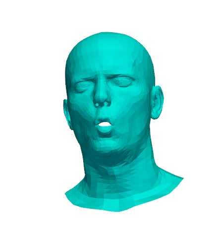

# FLAME Avatar Driver

Real-time facial animation system that drives a 3D FLAME head model using MediaPipe face tracking. Captures facial expressions from video or webcam and animates a 3D avatar in real-time.



## ✨ Features

- 🎭 **Real-time face tracking** using MediaPipe (52 ARKit blendshapes)
- 🗿 **3D avatar animation** with FLAME model (100 expression coefficients)
- 🎯 **Pre-trained mappings** for accurate expression transfer
- 🔄 **Head pose tracking** with natural mirror effect
- 😊 **Rich facial expressions**: jaw movement, smiles, blinks, eyebrow raises, mouth shapes, and more
- 🛠️ **Interactive tools** for debugging and exploration
- 🍎 **macOS/Apple Silicon optimized** using PyVista for visualization
- ⚡ **High performance**: 30+ FPS on modern hardware

## 📋 Requirements

- Python 3.8+
- macOS, Windows, or Linux
- Webcam or video file for input
- ~150 MB disk space for models

## 🚀 Installation

### 1. Clone the repository

```bash
git clone https://github.com/yourusername/flame-avatar-driver.git
cd flame-avatar-driver
```

### 2. Create virtual environment (recommended)

```bash
python -m venv venv
source venv/bin/activate  # On Windows: venv\Scripts\activate
```

### 3. Install dependencies

```bash
pip install -r requirements.txt
```

### 4. Download required models

#### MediaPipe Face Landmarker

```bash
curl -o face_landmarker.task https://storage.googleapis.com/mediapipe-models/face_landmarker/face_landmarker/float16/1/face_landmarker.task
```

Or download manually from [MediaPipe Models](https://storage.googleapis.com/mediapipe-models/face_landmarker/face_landmarker/float16/1/face_landmarker.task)

#### FLAME Model

1. Register at [FLAME Model Website](https://flame.is.tue.mpg.de/)
2. Download **FLAME 2020** (`generic_model.pkl`)
3. Place in `models/` folder

**Important:** The pre-trained mappings require FLAME 2020 specifically.

### 5. Download pre-trained mappings

The mapping files should already be in the `mappings/` folder. If not:

```bash
python tools/download_mappings.py
```

## 🎮 Usage

### Basic Usage

```bash
python src/main.py
```

By default, this uses a video file specified in the code. Press `q` to quit.

### Use with Webcam

Edit `src/main.py` and change line ~14:

```python
VIDEO_PATH = 0  # Change from 'example.mov' to 0 for webcam
```

### Adjust Zoom Level

In `src/main.py`, around line 32:

```python
ZOOM = 0.6  # Smaller value = bigger face
            # Try values: 0.4 (very close), 0.6 (recommended), 0.8 (far)
visualizer = Visualizer(translator.model['f'], zoom=ZOOM)
```

### Fine-tune Expression Intensity

In `src/translator.py`, line ~125:

```python
expression = expression * 2.0  # Adjust multiplier
                                # 1.0 = normal, 2.0 = double, 3.0 = triple
```

## 🛠️ Tools

### FLAME Expression Explorer

Test individual FLAME expression components:

```bash
python tools/flame_explorer.py
```

Useful for understanding what each of the 100 expression coefficients does. Change the expression index in the file to explore different expressions.

### Blendshape Debugger

See what MediaPipe detects in your video:

```bash
python tools/tracker_detailed.py
```

Shows active blendshapes with scores > 0.1 every 30 frames.

### Download Mappings

Download pre-trained MediaPipe to FLAME mappings:

```bash
python tools/download_mappings.py
```

## 📁 Project Structure

```
flame-avatar-driver/
├── README.md                    # This file
├── LICENSE                      # MIT License
├── requirements.txt             # Python dependencies
├── .gitignore                   # Git ignore rules
│
├── src/                         # Main source code
│   ├── main.py                  # Main application
│   ├── translator.py            # MediaPipe → FLAME translation
│   └── visualizer.py            # PyVista 3D rendering
│
├── tools/                       # Development tools
│   ├── flame_explorer.py       # Expression explorer
│   ├── tracker_detailed.py     # Blendshape debugger
│   └── download_mappings.py    # Mapping downloader
│
├── mappings/                    # Pre-trained mappings
│   ├── bs2exp.npy              # Blendshape → Expression
│   ├── bs2eye.npy              # Blendshape → Eye pose
│   └── bs2pose.npy             # Blendshape → Jaw pose (optional)
│
├── models/                      # Model files (download separately)
│   └── README.md               # Download instructions
│
└── examples/                    # Example assets
    └── screenshots/             # Demo screenshots
```

## 🔬 How It Works

1. **Face Tracking**: MediaPipe detects 468 3D facial landmarks and computes 52 ARKit-compatible blendshape scores (0-1 normalized values)

2. **Translation**: Pre-trained linear transformation matrices convert the 52 MediaPipe blendshapes into 100 FLAME expression coefficients plus jaw and eye pose parameters

3. **Mesh Deformation**: FLAME's expression basis vectors deform the template mesh vertices based on the expression coefficients

4. **Head Pose**: Yaw and pitch angles are extracted from landmark positions and applied as rotation matrices (with mirror effect for natural viewing)

5. **Real-time Rendering**: PyVista displays the animated 3D mesh at 30+ FPS with smooth camera positioning

## 📊 Technical Details

- **Input Format**: 52 MediaPipe ARKit blendshapes (normalized 0-1)
- **Output Format**: 100 FLAME expression coefficients + 3 jaw pose params + 6 eye pose params
- **Mapping Type**: Linear transformation matrices (52×100, 52×3, 52×6)
- **3D Model**: FLAME 2020 (5,023 vertices, 9,976 triangles)
- **Training Data**: Mappings trained on NerSemble and IMAvatar datasets
- **Performance**: 30+ FPS on M1 MacBook, ~25 FPS on older Intel machines

## 🐛 Troubleshooting

### Expressions too subtle

**Solution 1**: Increase the global multiplier in `src/translator.py`:
```python
expression = expression * 3.0  # Try 2.0 to 5.0
```

**Solution 2**: Check that pre-trained mappings loaded successfully. You should see:
```
✓ Loaded expression mapping from: /path/to/mappings
```

### Avatar facing wrong direction

**Solution**: Adjust the rotation matrices in `src/main.py` around line 93. The key rotation is:
```python
R_y_180 = np.array([
    [np.cos(np.radians(180)), 0, np.sin(np.radians(180))],
    [0, 1, 0],
    [-np.sin(np.radians(180)), 0, np.cos(np.radians(180))]
])
```

Try adjusting the 180 degrees to other values (0, 90, 270) to find the correct orientation.

### "Pre-trained mappings not found"

**Solution**: Run the download script:
```bash
python tools/download_mappings.py
```

Or manually download from [PeizhiYan's repository](https://github.com/PeizhiYan/mediapipe-blendshapes-to-flame/tree/main/mappings).

### Low frame rate / stuttering

**Solutions**:
- Reduce video resolution
- Close other applications
- Update graphics drivers
- Check CPU usage (should be < 80%)

### "Cannot load FLAME model"

**Solutions**:
- Verify you downloaded **FLAME 2020** (not 2023 or other versions)
- Check file is named exactly `generic_model.pkl`
- Ensure file is in `models/` folder
- Verify file size is ~100 MB

### MediaPipe not detecting face

**Solutions**:
- Ensure good lighting
- Face the camera directly
- Check video file is valid and readable
- Try with webcam instead: `VIDEO_PATH = 0`

## 🎓 Credits & References

### Core Technologies
- **MediaPipe**: Google's ML solutions for face tracking
- **FLAME Model**: Max Planck Institute for Intelligent Systems
- **PyVista**: 3D visualization built on VTK

### Pre-trained Mappings
Based on the approach from [PeizhiYan's MediaPipe-to-FLAME repository](https://github.com/PeizhiYan/mediapipe-blendshapes-to-flame)

### FLAME Paper
```bibtex
@article{FLAME:SiggraphAsia2017,
  title = {Learning a model of facial shape and expression from {4D} scans},
  author = {Li, Tianye and Bolkart, Timo and Black, Michael J. and Li, Hao and Romero, Javier},
  journal = {ACM Transactions on Graphics (TOG), Proc. SIGGRAPH Asia},
  volume = {36},
  number = {6},
  year = {2017}
}
```

## 📄 License

This project is licensed under the MIT License - see the [LICENSE](LICENSE) file for details.

**Important Notes on Third-Party Content**:
- The FLAME model requires separate registration and licensing from MPI-IS
- MediaPipe is licensed under Apache 2.0 (Google LLC)
- Pre-trained mappings are for research and educational use only (based on public datasets)

## 🤝 Contributing

Contributions are welcome! Here's how you can help:

1. Fork the repository
2. Create a feature branch (`git checkout -b feature/amazing-feature`)
3. Commit your changes (`git commit -m 'Add amazing feature'`)
4. Push to the branch (`git push origin feature/amazing-feature`)
5. Open a Pull Request

### Areas for Contribution
- [ ] Add support for full-body SMPL-X model
- [ ] Implement temporal smoothing for more stable animations
- [ ] Add recording/export functionality
- [ ] Create GUI for parameter adjustment
- [ ] Add support for multiple faces
- [ ] Optimize for mobile/embedded devices
- [ ] Add more pre-trained mappings for different FLAME variants

## 🙏 Acknowledgments

Special thanks to:
- **PeizhiYan** for the MediaPipe-to-FLAME mapping approach
- **FLAME authors** for the parametric head model
- **MediaPipe team** for the face tracking solution
- The open-source community for invaluable tools and libraries

## 📬 Contact

For questions, issues, or suggestions:
- Open an issue on GitHub
- Email: [your-email@example.com]
- Twitter: [@yourusername]

---

⭐ If you find this project useful, please consider giving it a star on GitHub!
